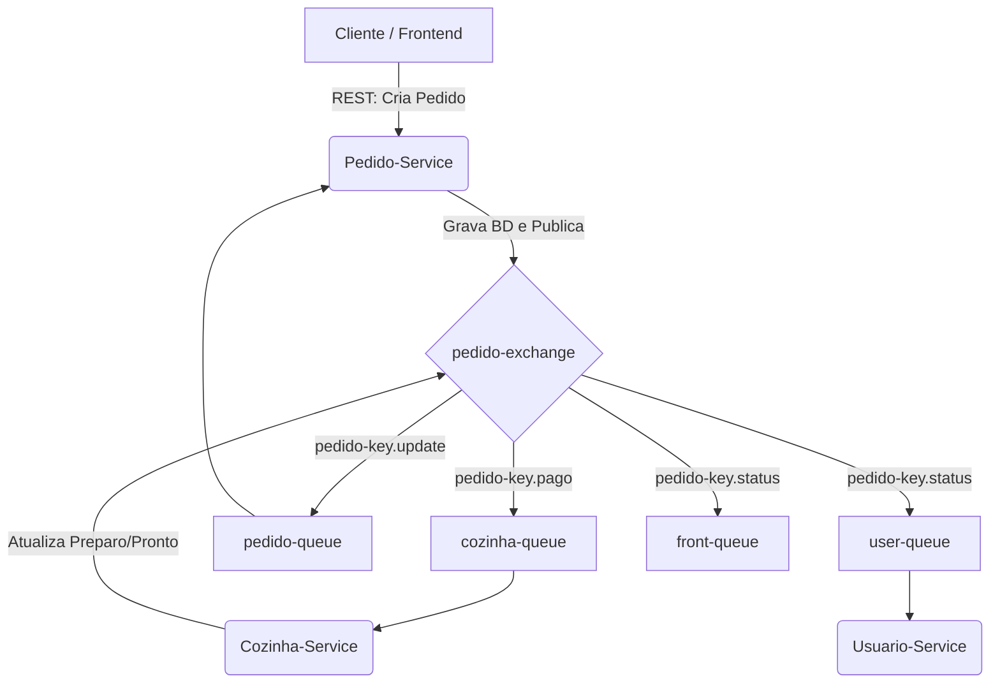

# Relatório do Trabalho Prático – Mensageria

**Instituição:** UNIVERSIDADE REGIONAL DE BLUMENAU - FURB
**Centro:** CENTRO DE CIÊNCIAS EXATAS E NATURAIS - DEPARTAMENTO DE SISTEMAS E COMPUTAÇÃO
**Disciplina:** Sistemas Distribuídos
**Professor:** Gabriel Castellani
**Data:** 08/05/2026
**Aluno:** Caike Machado Batista Costa

---

## 1. Descrição do Cenário

### Contextualização do ambiente
O sistema avaliado é o **MicroChefs**, uma plataforma moderna de *delivery* e gestão de restaurantes baseada em microsserviços. O ecossistema é fragmentado em múltiplos serviços independentes e conteinerizados (via Docker): Usuários, Produtos, Pedidos e Cozinha. 

### Justificativa da necessidade de comunicação assíncrona
Em um cenário de restaurante e aplicativos de delivery, há picos dramáticos de demanda (horários de almoço e jantar). 
Se a comunicação entre o serviço que recebe o pedido do cliente (Pedido-Service) e a interface dos cozinheiros (Cozinha-Service) fosse síncrona, a indisponibilidade ou a lentidão da cozinha causaria o bloqueio completo do recebimento de novos pedidos na plataforma. 
Com a **mensageria assíncrona**, o Pedido-Service recebe a solicitação e publica um evento de que o pedido foi "Pago" na fila. Assim, a requisição é liberada imediatamente para o cliente. A cozinha pode consumir os pedidos no seu próprio ritmo, garantindo estabilidade e fluidez na experiência do usuário.

---

## 2. Arquitetura da Solução

### Identificação dos componentes produtores e consumidores
* **Pedido-Service:** Produtor (publica novos pedidos e pagamentos) e Consumidor (escuta atualizações da cozinha para sincronizar o status).
* **Cozinha-Service:** Consumidor (escuta novos pedidos pagos) e Produtor (notifica que um pedido começou a ser preparado ou foi finalizado).
* **Usuario-Service:** Consumidor (escuta finalizações de pedidos para manter o histórico de consumo do usuário atualizado).
* **Serviço de DLQ (DLQ Support):** Consumidor exclusivo para auditar e salvar falhas (escuta a *Dead Letter Queue* e grava os erros no banco).

### Definição do fluxo de mensagens

### Estratégias de escalabilidade, confiabilidade e tolerância a falhas
* **Escalabilidade:** Como os consumidores funcionam via concorrência (*competing consumers*), em momentos de alta demanda, podemos provisionar diversas instâncias do `Cozinha-Service`. O RabbitMQ usará *Round-Robin* para dividir os pedidos entre as instâncias, escalando o processamento horizontalmente.
* **Tolerância a falhas (DLQ):** Mensagens que geram exceções e não podem ser processadas não entram em _loop_ infinito travando a fila principal. Elas são roteadas automaticamente para a `dead-letter-queue`.
* **Confiabilidade:** Todas as filas estão definidas com propriedades nativas de durabilidade (`durable = true`), protegendo o andamento dos dados caso o RabbitMQ precise ser reiniciado (falha de hardware, por exemplo).

---

## 3. Configuração do RabbitMQ

### Parâmetros de Configuração
* **Exchanges:** O sistema utiliza `TopicExchange`, o que permite um roteamento avançado baseado em padrões.
  * `pedido-exchange`
  * `dead-letter-exchange`
* **Filas e Bindings:**
  * `pedido-queue`: faz o binding com `pedido-exchange` usando a chave de roteamento `pedido-key.update`.
  * `cozinha-queue`: faz o binding com a chave `pedido-key.pago`.
  * `user-queue` e `front-queue`: ambas ligadas à mesma chave `pedido-key.status` utilizando fan-out contextual do tipo Tópico (o evento é entregue às duas filas separadas simultaneamente).
  * `dead-letter-queue`: escuta a chave `dead-message` no `dead-letter-exchange`.

### Requisitos de segurança
* A arquitetura foi encapsulada na infraestrutura do Docker dentro de uma **Rede Privada** (`private_network`). Apenas conexões internas têm acesso à porta 5672 (AMQP).
* Mecanismos de autenticação ativados via variáveis de ambiente (`SPRING_RABBITMQ_USERNAME` e `PASSWORD` definidos como `admin` e `admin`).
* Para produção, indica-se também o tráfego criptografado via SSL/TLS (AMQPS) e restrições de permissões com a criação de *Virtual Hosts* exclusivos separados pelas integrações de negócio.

---

## 4. Exemplos de Uso

**Cenário: Processamento de pagamento efetuado**
* **Entradas:** O webhook de transações confirma o pagamento de um cliente e faz a requisição no endpoint do Pedido-Service para `status = PAGO`.
* **Processamento:** 
  1. O Microsserviço de Pedidos altera o status transacional do banco.
  2. A seguir, serializa o objeto representativo do pedido (ID, descrição) em uma string e despacha para o RabbitMQ na `pedido-exchange` (`Route: pedido-key.pago`).
* **Saídas esperadas:** A mensagem é alocada na `cozinha-queue`. A interface ou totem do cozinheiro atualiza de forma reativa a tela, sinalizando o novo pedido. Paralelamente, o front-end do consumidor confirma que o pedido foi pago e aguarda aprovação física do restaurante.

---

## 5. Considerações Técnicas

### Tecnologias e Linguagens Utilizadas
* **Mensageria:** RabbitMQ 3 Management (em container Docker).
* **Backend:** Ecossistema Java com Spring Boot (Cozinha-Service, Pedido-Service, DLQ-Support, Produto-Service), integrado com Spring AMQP. 
* O **Usuario-Service** foi desenvolvido em C# (.NET), demonstrando acoplamento agnóstico perfeito no formato poliglota arquitetural viabilizado pelas filas.
* **Frontend:** Angular.
* **Infraestrutura:** Docker e Docker Compose, Eureka Server para Service Discovery. Bancos PostgreSQL e MySQL.

### Padrões de Mensagens
As mensagens trocadas seguem estruturação padrão simples via **JSON**. O encapsulamento não contém classes amarradas de linguagens específicas e contém os dados vitais de *payload*, maximizando a flexibilidade e a eficiência da rede.

### Boas práticas adotadas
* O RabbitMQ foi configurado para **Auto-Queue Creation** durante a inicialização no Spring. Assim, filas/exchanges são garantidas e não necessitam de criação manual na interface de gerenciamento (*management UI*).
* A separação lógica através de roteamento hierárquico `pedido-key.*` isola o tráfego. A Cozinha consome estritamente da fila abastecida apenas quando a Routing Key é de fato `.pago`, sem desperdiçar recursos descartando *logs* ou eventos inválidos.
